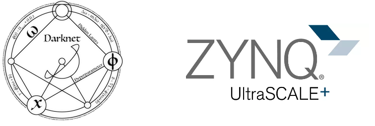

# Darknet #
Darknet is an open source neural network framework written in C and CUDA. It is fast, easy to install, and supports CPU and GPU computation.

For more information see the [Darknet project website](http://pjreddie.com/darknet).

For questions or issues please use the [Google Group](https://groups.google.com/forum/#!forum/darknet).

# Darknet + ZYNQ #
Supports low precision training and inference on CPU and FPGA. 
